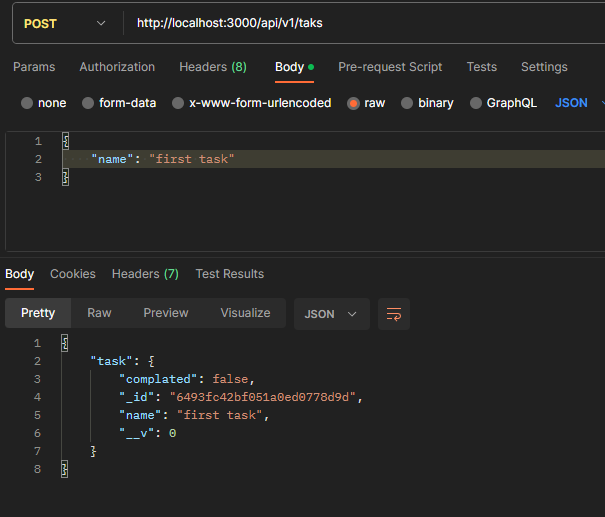
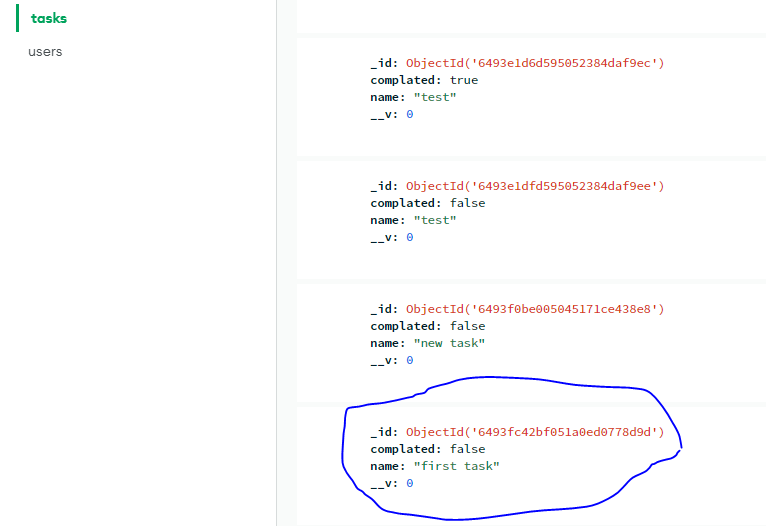

## we create function call createtaks that creats new task doucment in our Task collection
## the function take two agruments req to requset daya res to send respone
```js
const Task = require('../moodel/task') // Task come from our model that we create our schema there
                                       // task with small t we create to store our new task
const createtaks = async(req,res)=>{
    try {
    const task = await Task.create(req.body);//task.create is methods provied from mongoose
    res.status(201).json({task}) //after we write what we want will res will send json file to our database collection (Task)
    } catch (err){
         res.status(500).json({msg:err})
    }

}
```
## here we write somthing and we see that what we write goes to our task collection


## now if we check our database in task collection we will see new document create

